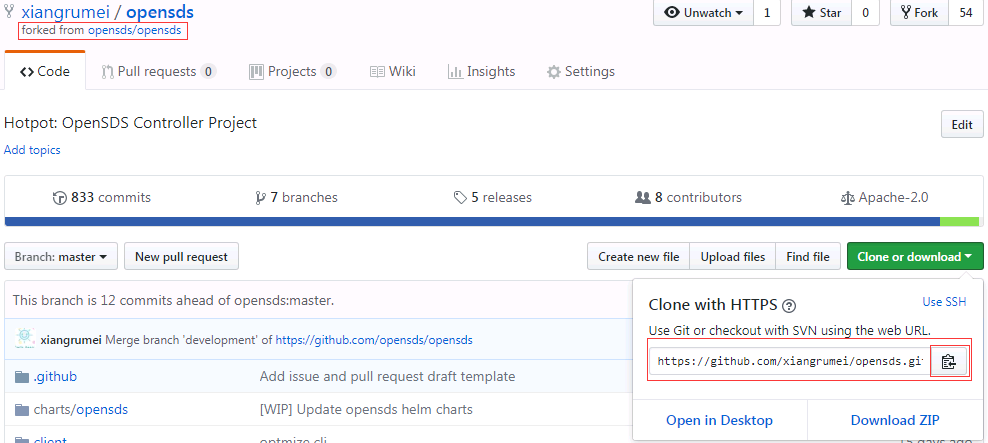

给GitHub项目贡献代码，首先需要了解git基本命令，其次是需要在GitHub上注册一个账号。

在GitHub上注册了账号后，登录，然后查找想要贡献的repository，查到后点project主界面右上角的fork按钮。


等待fork完毕后，回到自己的GitHub账号下，可以看到被fork的repository，进入自己账号想刚fork的project，可以复制project的地址，分为https和git两种地址。


点击复制可以进行地址复制，然后在本地调出git bash命令框进行复制。复制完后进入项目目录中。
```
git clone https://github.com/xxxx.git
cd xxxx
```

进入项目目录后可以使用git remote -v查看当前项目的远端地址，通常默认会有origin标识的远端fetch和push地址。
```
git remote -v
origin  https://github.com/xxxx.git (fetch)
origin  https://github.com/xxxx.git (push)
```
此时，远端的fetch和push地址都是我们自己项目的地址，跟fork的源地址还没有任何关联，接下来就是需要和源project地址关联起来，目的是能够及时将源project的更新及时拉取到本地项目。具体做法为：
```
git remote add upstream https://github.com/yyyy.git
```
这里用upstream作为源project的标签，此时可以用git remote -v检查git远端地址，会发现多了upstream标识的远端fetch和push地址。
```
$ git remote -v
origin  https://github.com/xxxx.git (fetch)
origin  https://github.com/xxxx.git (push)
upstream        https://github.com/yyyy.git (fetch)
upstream        https://github.com/yyyy.git (push)

```
看到这些信息后，就可以进行本地开发了，特性需求在本地开发完后，按照正常的git流程进行提交代码。
```
git status
git add .
git commit -m "add new feature code"
```

此时就完成了代码在本地提交，但还未完成，正常需要将代码push到远端才结束，接下来很关键，在push到远端个人库前，做一次从源project pull的动作，目的是及时合入远端最新代码到本地，同时也可以检查源库代码与本地代码是否有冲突。
```
git pull upstream master
git push origin master
```

到这一步，本地开发的新代码就已经合入到自己远端的git库了，并且还做了冲突防护和新增代码合入。
最后一步，到源库创建PR，将自己库的分支合入到源库分支，也就是完成代码真正意义上的合入（贡献）。具体做法是到源库，点击pull request，创建一个新的PR，点击compare cross fork。


点击create后，就等待自己的PR被管理员合入。

